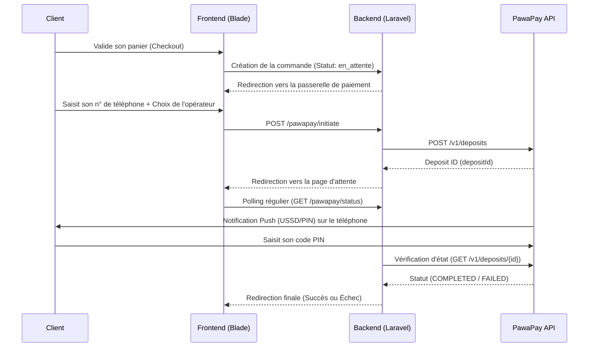

# 📘 Documentation Technique — Intégration PawaPay (Mobile Money)

Cette documentation détaille de manière exhaustive l'architecture, les composants, et les flux du système de paiement automatisé **PawaPay (Mobile Money)** intégré dans la plateforme e-commerce **Stepora**.

---

## 1. Architecture Globale du Flux de Paiement

L'intégration de PawaPay repose sur une architecture asynchrone (API REST + Polling/Webhooks) conçue pour offrir une expérience "Fintech" fluide et sécurisée.



---

## 2. Structure de la Base de Données

La table `commandes` a été étendue pour gérer la dualité entre l'ancien système manuel et le nouveau système automatisé.

| Colonne | Type | Description |
| :--- | :--- | :--- |
| `payment_status` | `enum` | L'état en temps réel du paiement : `non_paye`, `en_verification`, `payee`, `refusee`. |
| `pawapay_deposit_id` | `string` (UUID) | Identifiant unique de transaction renvoyé par PawaPay (ex: `bb580c2b-...`). S'il est présent, le système sait que c'est un paiement automatisé. |
| `mobile_money_provider` | `string` | Le code officiel de l'opérateur chez PawaPay (ex: `VODACOM_MPESA_COD`, `AIRTEL_COD`, `ORANGE_COD`). |
| `mobile_money_number` | `string` | Le numéro de téléphone formaté (sans le 0 initial, ni le code pays) qui a été débité. |
| `payment_method` | `string` | Conserve les anciennes valeurs (`mpesa`, `orange_money`) pour la rétrocompatibilité manuelle. |
| `payment_proof` | `string` | (Ancien système) Chemin vers l'image de la capture d'écran du paiement. |

---

## 3. Interfaces Utilisateurs (UI/UX)

Quatre vues Blade dédiées au flux de paiement PawaPay ont été créées avec un design premium (charte graphique Fintech, sobre, sans éléments parasites) :

### A. Choix du mode de paiement (`paiement.blade.php`)
- **UI** : Grille avec les vrais logos des opérateurs (M-Pesa, Airtel, Orange).
- **UX** : 
  - Nettoyage en temps réel du champ de saisie (suppression des espaces, lettres, et du `0` initial pour PawaPay).
  - Validation visuelle immédiate du réseau sélectionné (bordure bleue + coche).
  - Verrouillage du bouton `Confirmer` après soumission pour éviter les doubles requêtes.

### B. Page d'attente / Chargement (`pawapay_attente.blade.php`)
- **UI** : Spinner circulaire SVG animé avec compte à rebours de 60 secondes.
- **Logique** : 
  - Un script JS interroge le serveur Laravel en boucle (Polling) via l'endpoint `/commande/{id}/pawapay/status` toutes les 5 secondes.
  - La page gère les redirections de manière autonome (vers Succès ou Échec) selon la réponse JSON du serveur.

### C. Pages de résultat (`pawapay_succes.blade.php` & `pawapay_echec.blade.php`)
- Design façon "Reçu électronique bancaire".
- **Succès** : Affiche un tableau récapitulatif (Transaction, Date, Opérateur, Email, Liste des produits achetés).
- **Échec** : Liste des causes probables d'échec (PIN faux, délai expiré, solde insuffisant) et propose un bouton pour "Réessayer".

---

## 4. Logique Backend (Contrôleurs et Services)

### Le Service PawaPay (`App\Services\PawaPayService`)
C'est le cœur de la communication avec l'API PawaPay.
- **Méthode `initiateDeposit`** : 
  - Construit le payload JSON requis par PawaPay (incluant le `depositId` unique généré par l'application, le montant, et la devise `CDF`).
  - Effectue un appel `POST` sécurisé.
- **Méthode `checkDepositStatus`** : 
  - Fait un `GET` sur `/v1/deposits/{depositId}`.
  - **Correction majeure apportée** : L'API de PawaPay renvoie la réponse dans un tableau JSON. Le service gère dynamiquement l'extraction du premier objet de la réponse (`$body[0]`) pour parser correctement les statuts.

### Le Contrôleur PawaPay (`PawaPayController`)
- **Génération de l'ID** : Utilise `(string) Str::uuid()` pour respecter les exigences de l'API.
- **Normalisation des numéros** : Le numéro utilisateur, qu'il commence par `081`, `24381` ou `+24381`, est automatiquement normalisé en `81` (pour s'adapter au `correspondent` PawaPay) via une regex stricte dans la méthode `initiateDeposit`.
- **Méthode `statusApi`** : Appelée silencieusement par le JavaScript de la page d'attente, elle interroge le `PawaPayService` et renvoie une réponse JSON (sans rafraîchir la page).

---

## 5. Gestion Côté Administrateur (Backoffice)

Le panel d'administration a été entièrement adapté pour supporter cette dualité de flux (Manuel VS Automatique).

### Liste des commandes en attente (`pending_payments.blade.php`)
- La colonne `Détails` s'adapte dynamiquement :
  - **Si c'est un paiement manuel** : Affiche l'image de la preuve (cliquable) et le bouton *Valider*.
  - **Si c'est un paiement PawaPay** : Affiche le numéro de téléphone, l'ID de la transaction PawaPay, et un badge bleu *"PawaPay · Auto"*.

### Page de détails d'une commande (`admin/commandes/show.blade.php`)
- Ajout d'une carte *"Paiement Mobile Money"* affichant le statut exact.
- **Bouton "Forcer la vérification" (Méthode `syncPawaPay`)** : 
  - *Problème adressé* : Si le client ferme sa page internet avant la fin des 60 secondes, et que le Webhook Ngrok échoue, la commande reste bloquée sur "En vérification".
  - *Solution* : Ce bouton permet à l'admin de forcer Laravel à interroger les serveurs PawaPay manuellement. Si la transaction est `COMPLETED`, Laravel met à jour la base de données, passe la commande en préparation, et envoie l'email de confirmation au client instantanément.

---

## 6. L'Espace "Mon Compte" Client

- Refonte du design complet pour un affichage "dashboard" moderne.
- L'historique des commandes utilise des barres de suivi dédiées (`Paiement` et `Livraison`).
- **Gestion des cas d'échec** : Si une commande PawaPay échoue, un bouton d'action *"Réessayer le paiement"* permet de réinjecter la commande dans le flux PawaPay au lieu de demander une preuve manuelle absurde.
- **Redirection Intelligente** : Si le client quitte la page de chargement (alors que le statut est "En vérification"), la page compte affiche le statut en attente et propose un bouton *"Suivre l'état"* qui le ramène sur la page du Spinner de chargement PawaPay.

---

## 7. Paramètres d'Environnement (.env) & Sécurité

> [!CAUTION]
> Les clés ci-dessous sont hautement sensibles. Ne jamais commiter le `.env` en production.

```env
PAWAPAY_API_BASE_URL="https://api.sandbox.pawapay.io"
PAWAPAY_JWT_TOKEN="votre_token_jwt_ici"
```

- **Sécurité SSL** : Lors des tests locaux avec ngrok, Laravel désactive la vérification stricte du certificat SSL via cURL (`verify => false`) dans le `PawaPayService`. En production, **il est obligatoire** d'activer la vérification SSL.
- **Comptes de Test (Sandbox RDC)** :
  L'API sandbox de PawaPay donne un accès automatique. Numéros magiques pour obtenir le statut `COMPLETED` immédiatement :
  - *Orange* : `243893456789`
  - *Airtel* : `243973456789`
  - *M-Pesa* : `243813456789`

---

## 8. Liste Complète des Fichiers Impactés

1. `app/Models/Commande.php` (Ajout des constantes de statuts)
2. `app/Services/PawaPayService.php` (Logique API)
3. `app/Http/Controllers/PawaPayController.php` (Logique Client)
4. `app/Http/Controllers/Web/Admin/CommandeController.php` (Logique Admin `syncPawaPay`)
5. `resources/views/commande/paiement.blade.php` (Vue initiation)
6. `resources/views/commande/pawapay_attente.blade.php` (Vue chargement/polling)
7. `resources/views/commande/pawapay_succes.blade.php` (Vue succès)
8. `resources/views/commande/pawapay_echec.blade.php` (Vue échec)
9. `resources/views/compte/show.blade.php` (Page historique du client)
10. `resources/views/admin/commandes/pending_payments.blade.php` (Liste des validations pour admin)
11. `resources/views/admin/commandes/show.blade.php` (Détails admin & Forcer vérification)
12. `routes/web.php` (Ajout de toutes les nouvelles routes PawaPay et Admin)
